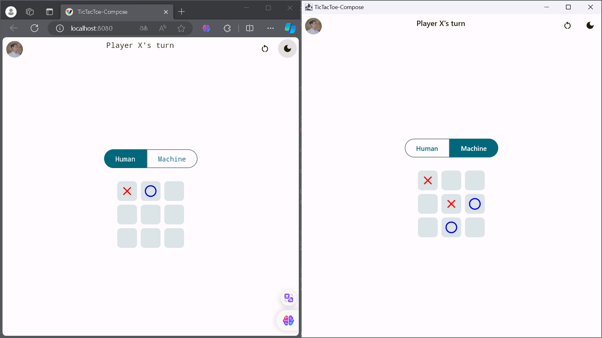
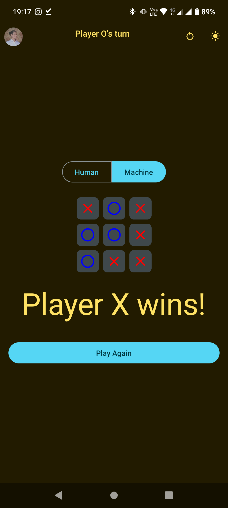

Para documentação em português, consulte o [README em Português](docs/README.pt.md).

# Tic Tac Toe in Compose Multiplatform

This is a simple Tic Tac Toe game implemented in Jetpack Compose, a declarative UI library for Android, and Compose Multiplatform, allowing the application to run on Android, Web, and Desktop.

## Personal Story

This project is a reinterpretation of a Tic Tac Toe game I created at the age of 11 using HTML, CSS, and JavaScript. Now, years later, I've decided to recreate it using more advanced technologies such as Jetpack Compose and Compose Multiplatform.

## Prerequisites

- [IntelliJ IDEA](https://www.jetbrains.com/idea/) or Android Studio 4.2 or higher
- Kotlin 1.5.20 or higher
- Web browser for running on the Web
- Compose Multiplatform compatible development environment for running on Desktop

## How to Run the Application

1. Clone the repository:

    ```bash
    git clone https://github.com/eduardomcb/tictactoe-compose-multiplatform.git
    ```

2. Open the project in IntelliJ IDEA or Android Studio.

3. Run the application on an emulator, Android device, web browser, or desktop environment. The steps for each are outlined below.

### Before Running!

- Install JDK 17 on your machine
- Add a `local.properties` file to the project root and set the path to the Android SDK there

### Android

To run the application on an Android device/emulator:

- Open the project in Android Studio or IntelliJ IDEA and run the imported Android run configuration.

To build the app package:

- Run `./gradlew :composeApp:assembleDebug`
- Find the `.apk` file at `composeApp/build/outputs/apk/debug/composeApp-debug.apk`

### Desktop

Run the desktop application: `./gradlew :composeApp:run`

### Browser

Run the application in the browser: `./gradlew :composeApp:jsBrowserDevelopmentRun`

## Features

- Modern user interface using Jetpack Compose.
- Game logic implemented with ViewModel and StateFlow.
- Option to play against the machine.
- Option to change the app theme.
- Option to reset the game.

## Screenshots
<div style="display: flex; flex-direction: column; align-items: center;">
    
    
</div>

## Contribution

Contributions are welcome! If you encounter issues or want to add new features, feel free to create issues and pull requests.

## License

This project is licensed under the [MIT License](LICENSE).
