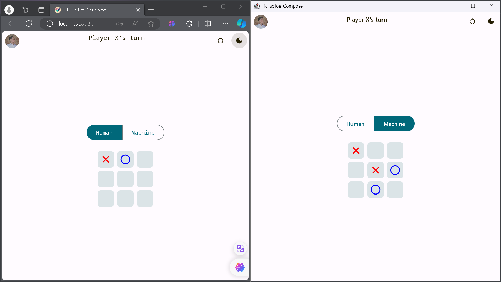
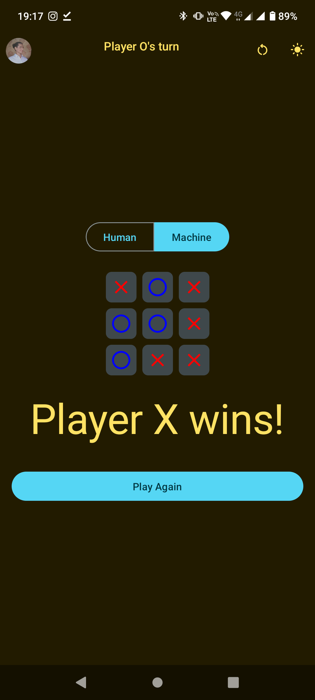

For English documentation, please see the [English README](../README.md).

# Tic Tac Toe in Compose Multiplatform

Este é um simples jogo da velha (Tic Tac Toe) implementado em Jetpack Compose, uma biblioteca de UI declarativa da
Android, e Compose Multiplatform, permitindo a execução do aplicativo em Android, Web e Desktop.

## História Pessoal

Este projeto é uma releitura de um jogo da velha que eu criei aos 11 anos usando HTML, CSS e JavaScript. Agora, anos depois, decidi refazê-lo usando tecnologias mais avançadas como Jetpack Compose e Compose Multiplatform.

## Pré-requisitos

- [IntelliJ IDEA](https://www.jetbrains.com/idea/) ou Android Studio 4.2 ou superior
- Kotlin 1.5.20 ou superior
- Navegador Web para execução na Web
- Ambiente de desenvolvimento compatível com Compose Multiplatform para execução no Desktop

## Como executar o aplicativo

1. Clone o repositório:

    ```bash
    git clone https://github.com/eduardomcb/tictactoe-compose-multiplatform.git
    ```

2. Abra o projeto no IntelliJ IDEA ou Android Studio.

3. Execute o aplicativo em um emulador, dispositivo Android, navegador da web ou ambiente de desktop. As etapas para cada um são descritas abaixo.

### Antes de executar!

- Instale o JDK 17 em sua máquina
- Adicione um arquivo `local.properties` à raiz do projeto e defina o caminho para o SDK do Android lá

### Android

Para executar o aplicativo em um dispositivo/emulador Android:

- Abra o projeto no Android Studio ou IntelliJ IDEA e execute a configuração de execução Android importada.

Para construir o pacote de aplicativo:

- Execute `./gradlew :composeApp:assembleDebug`
- Encontre o arquivo `.apk` em `composeApp/build/outputs/apk/debug/composeApp-debug.apk`

### Desktop

Execute o aplicativo de desktop: `./gradlew :composeApp:run`

### Navegador

Execute o aplicativo no navegador: `./gradlew :composeApp:jsBrowserDevelopmentRun`

## Recursos

- Interface de usuário moderna usando Jetpack Compose.
- Lógica de jogo implementada com ViewModel e StateFlow.
- Opção de jogar contra a máquina.
- Opção para mudar o tema do aplicativo.
- Opção para resetar o jogo.

## Capturas de tela
<div style="display: flex; flex-direction: column; align-items: center;">
    
    
</div>

## Contribuição

Contribuições são bem-vindas! Se você encontrar problemas ou quiser adicionar novos recursos, fique à vontade para criar
issues e pull requests.

## Licença

Este projeto é licenciado sob a [MIT License](../LICENSE).
